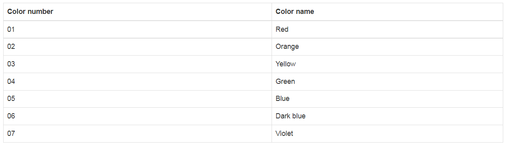
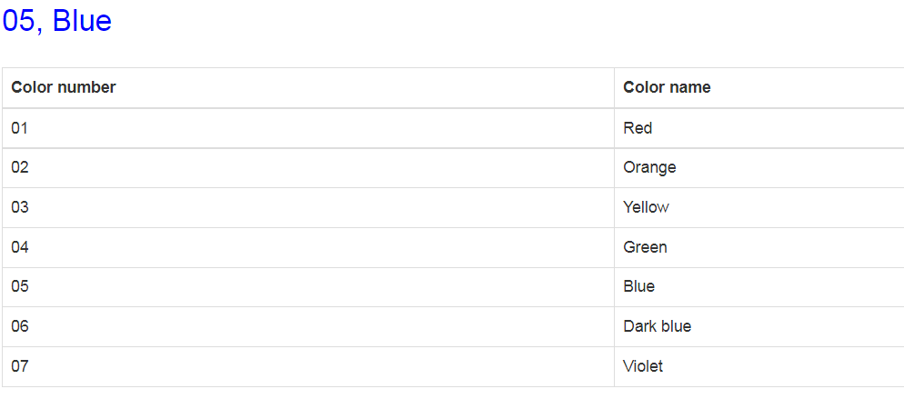
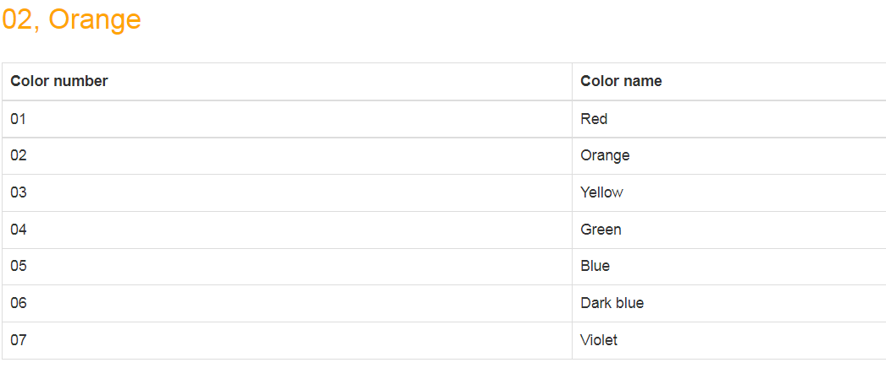

## Тестовое задание.

#### Стек: java 15, Servlets, postgresql, tomcat, Jsp/Js.

А) Дана таблица из 7 цветов c названием «TSVETA» в виде:
### Поля таблицы:
    id NUMBER NOT NULL 
    color_number VARCHAR2(2)
    name VARCHAR2(50)

### Значения в таблице:
    id color_number name 
    1 01 Red 
    2 02 Orange 
    3 03 Yellow 
    4 04 Green 
    5 05 Blue 
    6 06 Dark blue 
    7 07 Violet

Нужно на java используя JDBC получить данные 2-й и 3-й колонок и заполнить ими любую java-коллекцию значениями объектов.

Далее вернуть эту коллекцию в jsp-страницу в виде JSON (org.json.JSONArray): [{“color_number”:”01”, “name”:”Red”}, …]

Отобразите в jsp-странице информацию из JSON в виде таблицы (color_number, name).

Б) При выборе (наведении и нажатии мышкой) на ячейку таблицы с названием цвета «name» из ранее выведенных на экран строк
из JSON в виде таблицы, в отдельном поле выше таблицы должны появляться/отображаться данные из всей строки «выбранной
мышкой» через запятую, а цвет фона строки должен быть как написано в поле «name». Сделать эту часть задачи используя
Javascript конструкцию.

#### Чтобы запустить проект, нужно подключить postgres, выполнить скрипт, который лежит в папке db/schema.sql, подключить tomcat

## Демо

## Контакты
Если у вас остались вопросы, вы можете связаться со мной.
* Telegram: @vbgrishin
